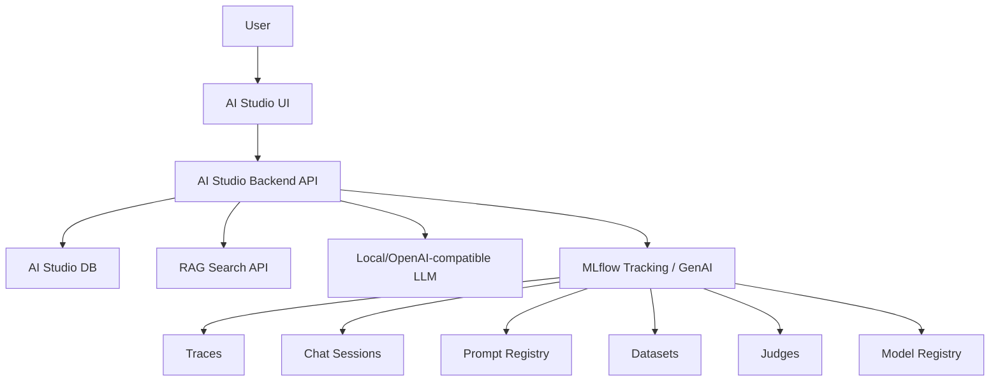

# AI Studio Agent Builder 제안서

## 목적

현재 MLflow에는 `traces`, `chat-sessions`, `prompts`, `judges`, `datasets`, `models` 같은 강력한 기능이 있다.
하지만 일반 사용자가 보기에는 각각의 메뉴가 분리되어 있어 "에이전트를 만든다"는 작업 흐름으로 이해하기 어렵다.

AI Studio는 MLflow 기능을 그대로 노출하는 화면이 아니라, 사용자가 에이전트를 쉽게 만들고 테스트하고 평가하고 배포할 수 있게 하는 상위 플랫폼이 되어야 한다.

핵심 방향:

```text
MLflow = 관측/평가/레지스트리 엔진
AI Studio = 사용자가 에이전트를 만드는 작업대
RAG API = 지식 검색 엔진
AI Studio DB = 사용자/권한/에이전트 설정 저장소
```

## 왜 필요한가

MLflow 메뉴는 개발자/운영자 관점에 가깝다.

```text
traces
chat-sessions
prompts
judges
datasets
models
```

반면 사용자는 아래 흐름을 원한다.

```text
에이전트 만들기
문서/RAG 연결하기
프롬프트 수정하기
테스트 채팅하기
평가 데이터 만들기
Judge로 평가하기
모델 등록/배포하기
실행 기록 확인하기
```

따라서 AI Studio는 MLflow 기능을 사용자 작업 흐름에 맞게 재구성해야 한다.

## 메뉴 매핑

| MLflow 기능 | AI Studio 화면 이름 | 사용자 관점 |
| --- | --- | --- |
| `prompts` | Prompt Studio | 에이전트 지시문/말투/규칙 관리 |
| `datasets` | Test Sets | 평가용 질문/기대값 세트 |
| `judges` | Evaluation Rules | 답변 품질 평가 기준 |
| `traces` | Observability | 실행 과정, 오류, latency, RAG 검색 결과 확인 |
| `chat-sessions` | Sessions | 사용자별 대화 기록 |
| `models` | Deployments | 등록된 에이전트 버전과 배포 상태 |

## 제안 화면 구조

```text
AI Studio
├── Agents
│   ├── Overview
│   ├── Build
│   ├── Test
│   ├── Evaluate
│   ├── Sessions
│   ├── Traces
│   └── Deploy
├── Prompt Studio
├── Knowledge / RAG
├── Test Sets
├── Evaluation Rules
├── Models / Deployments
└── Admin
```

Agent Detail 화면은 아래처럼 구성한다.

```text
Agent Detail
├── Overview
│   ├── 모델
│   ├── 프롬프트 버전
│   ├── RAG 연결 상태
│   └── 최근 평가 점수
├── Build
│   ├── Prompt
│   ├── Tools
│   ├── Knowledge / RAG
│   └── Model Config
├── Test
│   ├── Chat UI
│   └── Save as Dataset
├── Evaluate
│   ├── Dataset 선택
│   ├── Judge 선택
│   └── 평가 결과
├── Sessions
│   └── 사용자 대화 기록
├── Traces
│   └── 실행 상세 / 오류 / latency / RAG 검색 문서
└── Deploy
    └── Model Registry / endpoint
```

## 사용자 플로우

### 1. 에이전트 생성

```text
에이전트 이름 입력
-> 모델 선택
-> 기본 프롬프트 선택
-> RAG/Search API 연결
-> 저장
```

내부 처리:

```text
AI Studio DB agents 생성
MLflow experiment 생성 또는 연결
기본 prompt 등록
```

### 2. 테스트 채팅

```text
사용자가 Chat UI에서 질문
-> AI Studio Backend가 agent 실행
-> RAG API 호출
-> LLM 호출
-> MLflow trace 저장
-> chat session 저장
```

MLflow trace에는 아래 metadata/tag를 남긴다.

```text
mlflow.trace.session
mlflow.trace.user
agent_id
workspace_id
user_id
session_id
```

### 3. Dataset 저장

테스트 채팅 중 좋은 질문/답변을 바로 평가 데이터로 저장할 수 있어야 한다.

```text
채팅 메시지 선택
-> "Dataset에 저장"
-> 질문, 기대 답변, 태그 저장
-> MLflow Dataset 생성/업데이트
```

이 기능이 중요하다.
사용자가 에이전트를 테스트하면서 자연스럽게 평가 데이터가 쌓이기 때문이다.

### 4. Judge 평가

```text
Dataset 선택
-> Judge 선택
-> 평가 실행
-> 점수/실패 케이스 확인
```

Judge 예시:

```text
응답 길이
한국어 답변 여부
금지어 포함 여부
도시명 포함 여부
RAG 문서 근거 사용 여부
```

### 5. 모델 등록/배포

```text
평가 통과
-> Model Registry 등록
-> agent_versions 생성
-> 배포 endpoint 연결
```

## 아키텍처



권장 원칙:

```text
사용자 -> AI Studio만 접근
AI Studio Backend -> MLflow API 호출
MLflow UI 직접 노출은 운영자/관리자용으로 제한
```

## Backend API 제안

### Agents

```text
POST /api/agents
GET  /api/agents
GET  /api/agents/{agent_id}
PATCH /api/agents/{agent_id}
```

### Prompts

```text
POST /api/agents/{agent_id}/prompts
GET  /api/agents/{agent_id}/prompts
POST /api/agents/{agent_id}/prompts/{prompt_id}/publish
```

내부 MLflow 호출:

```python
mlflow.genai.register_prompt(...)
mlflow.genai.set_prompt_alias(...)
```

### RAG

```text
POST /api/agents/{agent_id}/rag-config
GET  /api/agents/{agent_id}/rag-config
POST /api/agents/{agent_id}/rag-test
```

검색 API 표준 요청:

```json
{
  "query": "MLflow 세션값은 어디에 남아?",
  "top_k": 3
}
```

검색 API 표준 응답:

```json
{
  "results": [
    {
      "id": "doc-1",
      "title": "MLflow Chat Sessions",
      "text": "Chat Sessions는 mlflow.trace.session metadata로 대화를 묶는다."
    }
  ]
}
```

### Chat

```text
POST /api/agents/{agent_id}/chat
GET  /api/agents/{agent_id}/chat-sessions
GET  /api/agents/{agent_id}/chat-sessions/{session_id}
```

### Traces

```text
GET /api/agents/{agent_id}/traces
GET /api/agents/{agent_id}/traces/{trace_id}
```

내부 MLflow 검색:

```python
mlflow.search_traces(
    experiment_ids=[experiment_id],
    filter_string="metadata.`agent_id` = 'ag_123'"
)
```

### Datasets

```text
POST /api/agents/{agent_id}/datasets
GET  /api/agents/{agent_id}/datasets
POST /api/datasets/{dataset_id}/records
```

내부 MLflow 호출:

```python
mlflow.genai.datasets.create_dataset(...)
dataset.merge_records(...)
```

### Judges / Evaluation

```text
POST /api/agents/{agent_id}/judges
GET  /api/agents/{agent_id}/judges
POST /api/agents/{agent_id}/evaluations
GET  /api/agents/{agent_id}/evaluations
```

### Model Registration / Deployments

```text
POST /api/agents/{agent_id}/register-model
GET  /api/agents/{agent_id}/versions
POST /api/agents/{agent_id}/deploy
GET  /api/deployments
```

## AI Studio DB 테이블 제안

MLflow는 실행/평가/레지스트리 기록을 잘 저장한다.
하지만 사용자, 권한, 에이전트 설정, 화면 상태는 AI Studio DB가 가져야 한다.

```text
users
workspaces
workspace_members
agents
agent_versions
rag_configs
tool_configs
datasets
judges
deployments
chat_sessions
audit_logs
```

핵심 테이블:

```text
agents
- id
- workspace_id
- name
- description
- status
- mlflow_experiment_id
- mlflow_registered_model_name
- created_by
- created_at
- updated_at

agent_versions
- id
- agent_id
- version
- prompt_name
- prompt_version
- model_name
- model_version
- rag_config_id
- judge_config_id
- dataset_id
- created_at

rag_configs
- id
- workspace_id
- name
- search_api_url
- auth_type
- secret_ref
- top_k
- created_at

chat_sessions
- id
- agent_id
- user_id
- mlflow_session_id
- title
- created_at
- updated_at
```

## 인증/권한

AI Studio 플랫폼으로 만들 경우 인증은 필요하다.

권한 예시:

```text
Admin
- 사용자/워크스페이스 관리
- 전체 에이전트/모델/데이터셋 관리
- 삭제/복구 가능

Builder
- 에이전트 생성/수정
- Prompt 수정
- Dataset 생성
- Judge 연결
- 모델 등록

Viewer
- 테스트 채팅
- Trace/Session 조회
- 평가 결과 조회
```

MLflow 서버는 직접 사용자에게 노출하지 않고, AI Studio Backend가 권한 확인 후 proxy/API 호출하는 방식이 안전하다.

## MVP 범위

1차 MVP는 너무 크게 잡지 않는 것이 좋다.

추천 MVP:

```text
1. Agent 생성/목록
2. Prompt 작성/등록
3. RAG Search API 연결
4. Test Chat
5. Chat -> Dataset 저장
6. 기본 Judge 평가
7. Traces/Chat Sessions 조회
8. Model Registry 등록
```

MVP에서 제외해도 되는 것:

```text
복잡한 배포 파이프라인
고급 권한 정책
다중 모델 라우팅
비용 최적화 대시보드
자동 프롬프트 튜닝
```

## 기대 효과

이 구조의 장점:

```text
사용자는 MLflow를 몰라도 에이전트를 만들 수 있다.
개발자는 MLflow trace로 문제를 디버깅할 수 있다.
운영자는 Dataset/Judge로 품질을 관리할 수 있다.
팀은 Prompt/Model 버전을 명확하게 추적할 수 있다.
RAG/Search API를 표준화해 여러 에이전트가 같은 지식 검색 구조를 재사용할 수 있다.
```

## 결론

AI Studio는 MLflow의 화면을 단순 복제하는 것이 아니라, MLflow 기능을 에이전트 개발 흐름으로 감싸는 제품이어야 한다.

최종 구조:

```text
AI Studio UI
-> AI Studio Backend API
-> AI Studio DB
-> MLflow API
-> RAG Search API
-> LLM / Tool APIs
```

이렇게 설계하면 사용자는 쉽게 에이전트를 만들고, 개발/운영팀은 MLflow 기반으로 실행 기록과 품질을 관리할 수 있다.
